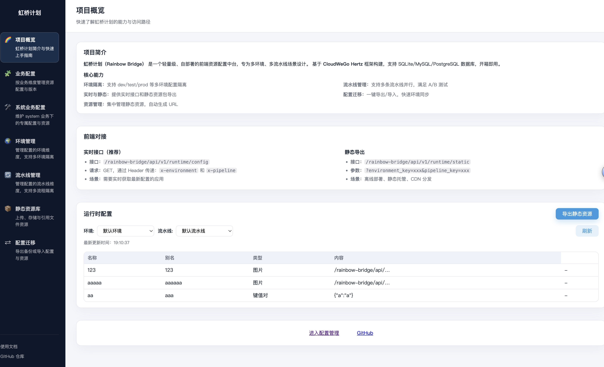

# 虹桥计划（Rainbow Bridge）技术设计文档

> **版本信息**  
> 版本：v1.1.4  
> Commit：b56ecf5

## 目录

1. [项目概述](#项目概述)  
2. [系统目标](#系统目标)  
3. [架构总览](#架构总览)  
4. [核心模块设计](#核心模块设计)  
5. [数据模型](#数据模型)  
6. [关键业务流程](#关键业务流程)  
7. [接口与协议](#接口与协议)  
8. [配置与环境](#配置与环境)  
9. [构建与交付](#构建与交付)  
10. [部署与运行](#部署与运行)  
11. [安全与权限](#安全与权限)  
12. [日志、监控与告警](#日志监控与告警)  
13. [AI 辅助开发](#ai-辅助开发)  
14. [未来规划](#未来规划)  
15. [License](#license)

---

## 项目概述

虹桥计划（Rainbow Bridge）是一套自部署的"静态资源与配置管理"中台。项目名称灵感源自连接人界与天界的七彩虹桥，寓意为前端/客户端团队搭建一座高效、安全的资源传输通道。  

系统基于 **CloudWeGo Hertz**（HTTP 网关）+ **GORM**（ORM）+ **SQLite/MySQL/PostgreSQL**（关系型数据库）构建，提供以下核心能力：

- **多维度配置管理**：按环境（Environment）+ 渠道（Pipeline）双维度隔离配置，支持业务配置和系统配置；  
- **多种数据类型**：支持键值对（KV）、JSON 对象、纯文本、图片、色彩标签等 5 种配置类型；  
- **在线资源管理**：上传、预览、导出、导入静态资源；  
- **静态站点生成**：将配置打包成 Nginx 静态站点或 zip 包；  
- **实时 API 接口**：通过 REST 接口供业务系统实时读取配置。  

### 界面预览



*虹桥计划主页 - 展示项目简介、前端对接方式和运行时配置演示*  

## 系统目标

1. **多维度配置管理**：以环境（Environment）+ 渠道（Pipeline）为维度管理配置，支持业务配置和系统配置；  
2. **统一交付产物**：支持导出 `static/config.json`、zip 包和 Docker 镜像，方便静态部署；  
3. **多种数据类型**：支持键值对、JSON 对象、文本、图片、颜色等多种配置类型，满足不同场景需求；  
4. **兼容多存储后端**：默认内置 SQLite，易于扩展到 MySQL/PGSQL 或对象存储；  
5. **可观测性**：预留鉴权、审计、监控接口，支持权限扩展能力。  

## 架构总览

```
               ┌───────────────────────────────┐
               │           Web Console         │
               │ (HTML/CSS/JS 静态管理界面)      │
               └──────────────┬────────────────┘
                              │ HTTP (REST)
                   ┌──────────▼───────────┐
                   │   CloudWeGo Hertz    │
                   │  (biz/router, handler│
                   │   & resourcepb handler)│
                   └──────────┬───────────┘
                              │
                ┌─────────────▼─────────────┐
                │        Service 层          │
                │ (biz/service/resource)     │
                └─────────────┬─────────────┘
                              │
                ┌─────────────▼─────────────┐
                │   DAO & 数据访问层        │
                │  (biz/dal/resource)       │
                └─────────────┬─────────────┘
                              │
                ┌─────────────▼─────────────┐
                │   数据库 + 文件存储       │
                │  SQLite/MySQL/PGSQL       │
                │  data/uploads/ 目录       │
                └───────────────────────────┘
```

同时，项目提供 GitHub Actions 工作流（`.github/workflows/release.yml`）实现多平台编译与 Docker 镜像构建：

- Go 交叉编译产物：`linux/windows/darwin` + `amd64/arm64`；  
- Docker 镜像：`linux/amd64`、`linux/arm64` 多架构推送至 GHCR。  

## 核心模块设计

### 1. 路由层（Router）

`biz/router/` 按功能模块划分，每个模块独立注册路由：

- **模块化路由**：
  - `environment/` - 环境管理路由
  - `pipeline/` - 渠道管理路由
  - `config/` - 配置管理路由
  - `asset/` - 静态资源路由
  - `runtime/` - 运行时配置路由
  - `transfer/` - 配置迁移路由
  - `version/` - 版本信息路由

- **统一注册**：`register.go` 负责初始化所有 handler 并注册路由到 Hertz 实例
- **入口文件**：`main.go` 加载配置、初始化数据库、注册路由和静态资源

### 2. Handler 层

`biz/handler/` 按模块划分，处理 HTTP 请求和响应：

- **模块化 Handler**：
  - `environment/environment_service.go` - 环境管理接口实现
  - `pipeline/pipeline_service.go` - 渠道管理接口实现
  - `config/config_service.go` - 配置管理接口实现
  - `asset/asset_service.go` - 静态资源上传、下载接口
  - `runtime/runtime_service.go` - 运行时配置获取、静态包导出
  - `transfer/transfer_service.go` - 配置导入导出接口
  - `version/version_service.go` - 版本信息接口

- **公共模块**：
  - `common.go` - 通用响应封装、错误处理、摘要生成
  - `ping.go` - 健康检查接口

### 3. Service 层

`biz/service/` 负责业务逻辑编排和数据转换：

- **核心服务文件**：
  - `service.go` - Service 结构体定义，封装数据库连接和通用方法
  - `config_service.go` - 配置增删改查逻辑
  - `asset_service.go` - 静态资源上传、列表查询逻辑
  - `runtime_service.go` - 运行时配置获取、静态包生成逻辑
  - `transfer_service.go` - 配置导入导出、ZIP 打包解析逻辑
  - `environment_service.go` - 环境管理逻辑
  - `pipeline_service.go` - 渠道管理逻辑

- **业务逻辑层**：
  - `logic.go` - 通用业务逻辑（环境和渠道管理）
  - `logic_config.go` - 配置验证、装饰、过滤逻辑
  - `logic_asset.go` - 资源引用解析、路径处理
  - `logic_environment.go` - 环境相关业务规则

- **初始化与测试**：
  - `seed.go` - 系统初始化（默认环境和渠道）
  - `service_test.go` - 单元测试覆盖

### 4. 数据访问层（DAO）

`biz/dal/db/` 提供面向 GORM 的 CRUD 封装：

- `environment_dao.go` - 环境表数据访问
- `pipeline_dao.go` - 渠道表数据访问
- `config_dao.go` - 配置表增删改查、按资源键查询
- `asset_dao.go` - 静态资源表增删改查、按环境渠道查询

### 5. 模型层

**数据库实体模型**（`biz/dal/model/`）：
- `environment.go` - 环境表实体
- `pipeline.go` - 渠道表实体
- `config.go` - 配置表实体
- `asset.go` - 静态资源表实体

**Protobuf 生成模型**（`biz/model/`）：
- `common/common.pb.go` - 通用消息类型（ResourceConfig、FileAsset 等）
- `environment/environment.pb.go` - 环境管理消息
- `pipeline/pipeline.pb.go` - 渠道管理消息
- `config/config.pb.go` - 配置消息
- `asset/asset.pb.go` - 静态资源消息
- `runtime/runtime.pb.go` - 运行时配置消息
- `transfer/transfer.pb.go` - 配置导入导出消息
- `version/version.pb.go` - 版本信息消息
- `api/api.pb.go` - API 路由注解定义

**注意**：所有 `*.pb.go` 文件由 `hz` 工具根据 `idl/` 目录下的 proto 文件自动生成，不应手动修改。

### 6. 静态控制台

`web/` 目录包含基于原生 ES6 模块的管理界面：

- **页面文件**：
  - `home.html/js` - 项目首页，展示简介和前端对接说明
  - `environment.html/js` - 环境管理页面
  - `pipeline.html/js` - 渠道管理页面
  - `config.js` - 配置管理（无独立 HTML，集成在其他页面）
  - `assets.html/js` - 静态资源库管理
  - `transfer.html/js` - 配置迁移（使用标签页区分导出和导入）

- **公共模块**：
  - `components.js` - 导航、页面布局、环境渠道切换器
  - `styles.css` - 全局样式
  - `lib/api.js` - API 请求封装
  - `lib/toast.js` - 消息提示组件
  - `lib/utils.js` - 工具函数
  - `lib/types.js` - 类型定义和常量


## 数据模型

### 1. 环境表 `Environment`

| 字段              | 类型     | 说明                                      |
|-------------------|----------|-------------------------------------------------|
| `environment_key` | string   | 环境唯一标识，例如 `dev`、`prod`            |
| `environment_name`| string   | 环境名称，例如 "开发环境"、"生产环境"        |
| `remark`          | string   | 备注信息                                      |
| `created_at`      | datetime | 创建时间                                      |
| `updated_at`      | datetime | 更新时间                                      |

### 2. 渠道表 `Pipeline`

| 字段              | 类型     | 说明                                      |
|-------------------|----------|-------------------------------------------------|
| `environment_key` | string   | 所属环境                                      |
| `pipeline_key`    | string   | 渠道唯一标识，例如 `main`、`feature-x` |
| `pipeline_name`   | string   | 渠道名称                                  |
| `remark`          | string   | 备注信息                                      |
| `created_at`      | datetime | 创建时间                                      |
| `updated_at`      | datetime | 更新时间                                      |

**联合唯一约束**：`(environment_key, pipeline_key)`

### 3. 配置表 `Config`

| 字段              | 类型     | 说明                                      |
|-------------------|----------|-------------------------------------------------|
| `resource_key`    | string   | 资源唯一标识                                  |
| `environment_key` | string   | 所属环境                                      |
| `pipeline_key`    | string   | 所属渠道                                  |
| `name`            | string   | 名称，例如 `api_base_url`              |
| `alias`           | string   | 别名/描述                                 |
| `content`         | text     | 配置内容（JSON 字符串 / 文本 / 引用）      |
| `type`            | varchar  | 数据类型：`text`、`number`、`boolean`、`object`、`image`、`color` 等 |
| `remark`          | string   | 备注信息                                      |
| `created_at`      | datetime | 创建时间                                      |
| `updated_at`      | datetime | 更新时间                                      |

**联合唯一约束**：`(resource_key, environment_key, pipeline_key, name)`

**数据类型说明**：
- `text`：纯文本，适用于字符串配置
- `number`：数值类型，整数或小数
- `boolean`：布尔值（true/false）
- `json`/`object`：JSON 对象，复杂配置数据
- `keyvalue`：键值对，存储为 JSON 对象
- `image`：图片资源引用
- `color`：颜色值（如 `#1677FF`）

### 4. 业务配置表 `Config`

| 字段          | 类型      | 说明                                |
|---------------|-----------|-------------------------------------|
| `resource_key`| string    | 资源唯一标识，默认 UUID             |
| `environment_key` | string | 所属环境                          |
| `pipeline_key`    | string | 所属渠道                        |
| `alias`       | string    | 别名，同一环境+渠道下唯一        |
| `name`        | string    | 名称                            |
| `type`        | enum      | 数据类型：`kv`、`config`、`text`、`image`、`color`|
| `content`     | text      | 配置内容（JSON 字符串 / 文本 / 引用）|
| `remark`      | string    | 备注信息                            |
| `is_perm`     | bool      | 是否属于权限配置                    |
| `created_at`  | datetime  | 创建时间                            |
| `updated_at`  | datetime  | 更新时间                            |

**联合唯一约束**：`(environment_key, pipeline_key, alias)`

### 5. 资源表 `Asset`

| 字段          | 类型    | 说明                                   |
|---------------|---------|----------------------------------------|
| `file_id`     | string  | 文件唯一 ID（UUID）                    |
| `business_key`| string  | 所属业务                                |
| `file_name`   | string  | 原始文件名                             |
| `content_type`| string  | Content-Type，用于下载时设置 MIME      |
| `file_size`   | int64   | 文件大小                               |
| `path`        | string  | 存储路径，相对 `data/` 目录            |
| `url`         | string  | 下载 URL（默认 `/api/v1/asset/file/{file_id}`，响应会自动补上 `server.base_path`） |
| `remark`      | string  | 备注                                   |
| `created_at`/`updated_at` | datetime | 创建/更新时间           |

SQLite 默认存储在 `data/resource.db`，静态文件默认落盘至 `data/uploads/`。

## 关键业务流程

### 1. 运行时配置获取

1. 客户端访问 `GET /api/v1/runtime/config`，通过 Header 传递 `x-environment` 和 `x-pipeline`；  
2. Handler 解析 Header 参数，调用 Service 查询配置列表；  
3. Service 根据环境和渠道查询系统配置和业务配置；  
4. DAO 利用 GORM 访问数据库，返回最新配置；  
5. Handler 将结果包装成 JSON 响应，包含配置列表和环境信息。

### 2. 静态资源上传

1. 前端通过 `POST /api/v1/asset/upload` 提交 multipart-form，携带 `environment_key` 和 `pipeline_key`；  
2. Handler 读取文件数据，调用 `Service.UploadAsset`；  
3. Service 将文件写入 `data/uploads/{file_id}/` 并创建数据库记录；  
4. 返回 `asset://{file_id}` 引用及资源元数据；  
5. 配置内容中可引用 `asset://` 前缀，导出时会自动替换为静态文件路径。

### 3. 静态包导出

1. 前端触发 `GET /api/v1/runtime/static?environment_key=xxx&pipeline_key=xxx`；  
2. Service 拉取配置与资源，生成 zip 包：  
   - `config.json`：系统配置和业务配置合并的 JSON；  
   - `assets/{file_id}/{filename}`：静态资源文件；  
3. 返回 zip 文件供用户下载，可直接部署到 Nginx 或 CDN。

## 接口与协议

### 1. REST 接口

项目接口按功能模块划分，每个模块由独立的 protobuf 定义：

#### 环境管理 (`/api/v1/environment/*`)
- `GET /api/v1/environment/list` - 获取环境列表
- `POST /api/v1/environment/create` - 创建环境
- `POST /api/v1/environment/update` - 更新环境
- `POST /api/v1/environment/delete` - 删除环境

#### 渠道管理 (`/api/v1/pipeline/*`)
- `GET /api/v1/pipeline/list` - 获取渠道列表（需传 `environment_key`）
- `POST /api/v1/pipeline/create` - 创建渠道
- `POST /api/v1/pipeline/update` - 更新渠道
- `POST /api/v1/pipeline/delete` - 删除渠道

#### 配置 (`/api/v1/config/*`)
- `GET /api/v1/config/list` - 获取配置列表
- `POST /api/v1/config/create` - 创建配置
- `POST /api/v1/config/update` - 更新配置
- `POST /api/v1/config/delete` - 删除配置
- `GET /api/v1/config/detail` - 获取配置详情

#### 静态资源 (`/api/v1/asset/*`)
- `GET /api/v1/asset/list` - 获取资源列表（需传 `environment_key` 和 `pipeline_key`）
- `POST /api/v1/asset/upload` - 上传静态资源（multipart-form）
- `GET /api/v1/asset/file/{file_id}` - 下载静态资源文件

#### 运行时配置 (`/api/v1/runtime/*`)
- `GET /api/v1/runtime/config` - 获取运行时配置（通过 Header `x-environment` 和 `x-pipeline`）
- `GET /api/v1/runtime/static` - 导出静态包（需传 `environment_key` 和 `pipeline_key`）

#### 配置迁移 (`/api/v1/transfer/*`)
- `GET /api/v1/transfer/export` - 导出配置（支持 json、zip、static 格式）
- `POST /api/v1/transfer/import` - 导入配置（支持 JSON 和 ZIP）
- `POST /api/v1/transfer/migrate` - 配置迁移（跨环境/渠道）

#### 版本信息 (`/api/v1/version`)
- `GET /api/v1/version` - 获取系统版本信息

### 2. Protobuf 定义

接口实现基于 CloudWeGo Hertz + Protobuf，定义位于 `idl/biz/` 目录：
- `environment.proto` - 环境管理
- `pipeline.proto` - 渠道管理
- `config.proto` - 配置管理
- `asset.proto` - 静态资源
- `runtime.proto` - 运行时配置
- `transfer.proto` - 配置导入导出
- `version.proto` - 版本信息

生成代码：`hz update -idl idl/biz/*.proto`

### 3. 鉴权与扩展

- 运行时配置接口通过 `x-environment` 和 `x-pipeline` Header 传递环境和渠道信息
- 其他接口通过 Query 参数或 Request Body 传递 `environment_key` 和 `pipeline_key`
- 未来可扩展统一鉴权中间件（Token / OAuth2 / API Key 等）

## 配置与环境

- `config.yaml`：主配置文件，包含 `server.address`、`database` 等；
- `server.base_path`：可选的统一访问前缀（如 `/rainbow-bridge`），启用后 API、静态控制台与返回的资源 URL 会自动携带该前缀，便于部署在反向代理或多租户网关之下；
- 若文件缺失，程序会使用默认配置（监听 `:8080`，使用 `sqlite` & `data/resource.db`）；
- `main.go` 启动流程：
  1. 加载配置；  
  2. 初始化数据库与自动迁移（Config/Asset 表）；  
  3. 执行 `EnsureSystemDefaults` 写入默认系统配置；  
  4. 注册路由与静态前端资源。

若切换数据库，可更新 `config.yaml` 中的 DSN 并确保对应驱动依赖（MySQL/PGSQL）。

## 构建与交付

### 1. 本地构建

- 普通构建：
  ```bash
  go build -o output/local/hertz_service .
  ```

- 交叉编译脚本：
  - `script/build_cross.sh`：一次性编译多个 OS/ARCH；  
  - `script/build_linux_amd64.sh`：专用于 Linux amd64，可在 macOS 上通过 `zig` 或 cross gcc 构建 CGO 版本（用于 SQLite）。

### 2. GitHub Actions

`.github/workflows/release.yml` 在推送 `v*` 标签时执行：

1. **多平台编译**：Linux/Windows/macOS × amd64/arm64，产物打包为 `tar.gz` 或 `zip`；  
2. **发布 Release**：聚合上述产物并上传到 GitHub Release；  
3. **Docker 多架构构建**：借助 Buildx + QEMU，通过 GHCR 推送 `linux/amd64` 与 `linux/arm64` 镜像，支持 `latest` 及 tag 对应版本。

### 3. Docker 支持

Dockerfile（未贴出）可结合上述多架构构建，支持容器化部署。镜像默认推送至 `ghcr.io/{owner}/rainbow_bridge`。

## 部署与运行

1. **依赖环境**：Go 1.22+、CGO（若使用 SQLite 且交叉编译）、可选的对象存储；  
2. **目录结构**：  
   - `data/resource.db`：默认 SQLite DB；  
   - `data/uploads/`：静态文件存储；  
   - `output/`：编译产物目录；  
3. **运行命令**：  
   ```bash
   ./hertz_service --config config.yaml
   ```
   或 Docker 方式运行指定镜像。

4. **静态站点部署**：`Export Static` 功能产出的 `static/config.json` + `static/assets/` 可直接丢到任意静态服务器（Nginx、CDN）。

### Docker Compose

仓库在 `deploy/docker-compose.yaml` 中提供了单实例 Compose 部署示例：

```bash
cd deploy
docker compose up -d
```

默认会挂载 `deploy/docker-compose/config.yaml` 作为容器内配置文件，并使用命名卷 `rainbow_bridge_data` 存储数据库/上传内容。需要自定义前置 Nginx 时，可参见 `deploy/nginx/` 提供的独立配置示例，根据环境将其部署为单独的容器或主机服务。根据需要修改 config、端口映射或卷路径即可。

### Nginx 代理示例

`deploy/nginx/` 目录包含 `rainbow-bridge.conf` 及使用说明，适用于容器化或物理机场景。默认将 `/rainbow-bridge/` 前缀代理到后端 8080 端口，并保留 gzip、302 重定向等设置，如需 HTTPS 或鉴权可自行扩展。

### 自动提示打 Tag

仓库提供 `script/auto_tag.sh` 和 `.githooks/post-commit`，用于在每次提交后交互式询问是否根据语义化版本（大版本/小版本/补丁）创建 Git tag。

启用方式：

```bash
git config core.hooksPath .githooks
chmod +x .githooks/post-commit script/auto_tag.sh
```

之后每次 `git commit` 完成都会提示是否打 tag，并可选择是否立即推送到 `origin`。在 CI 等非交互环境会自动跳过。

## 安全与权限

- 当前版本支持通过 `X-User-Id` 传递用户 ID，Service 层可依据 `is_perm` 字段限制普通用户访问。  
- 建议对外接口前加接入层（API 网关）或自定义认证中间件：  
  - Token / HMAC；  
  - OAuth2 / SSO；  
  - IP 白名单等。  
- 重要操作（删除、导入覆盖）应记录审计日志，可扩展到消息队列/日志中心。

## 日志监控与告警

- Hertz 默认提供基础日志，可结合 `logrus`/`zap` 接入结构化日志；  
- 数据库错误、文件系统异常均会返回 500，建议对接 Prometheus/Grafana 监控；  
- 可引入 Sentry/ELK stack 捕获 panic 或错误日志。


## 未来规划

1. **对象存储适配**：支持 AWS S3/阿里云 OSS 等，提升高可用；  
2. **鉴权与审计**：与公司统一的 IAM/权限系统集成；  
3. **多环境渠道**：支持资源多环境同步、差异比对；  
4. **更友好的前端体验**：配置 Diff、资产预览、批量操作；  
5. **自动化测试覆盖**：完善端到端测试、性能测试；  
6. **消息通知**：导入导出结果通过邮件/IM 通知。

## License

本项目遵循 [Apache License 2.0](LICENSE)。
