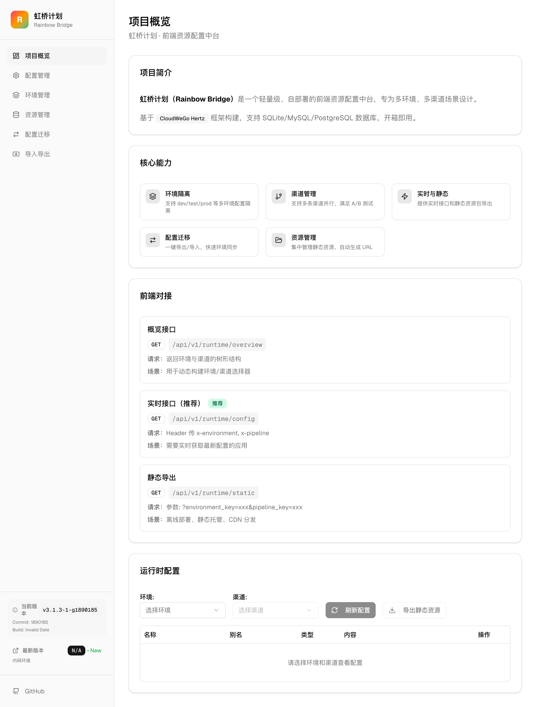
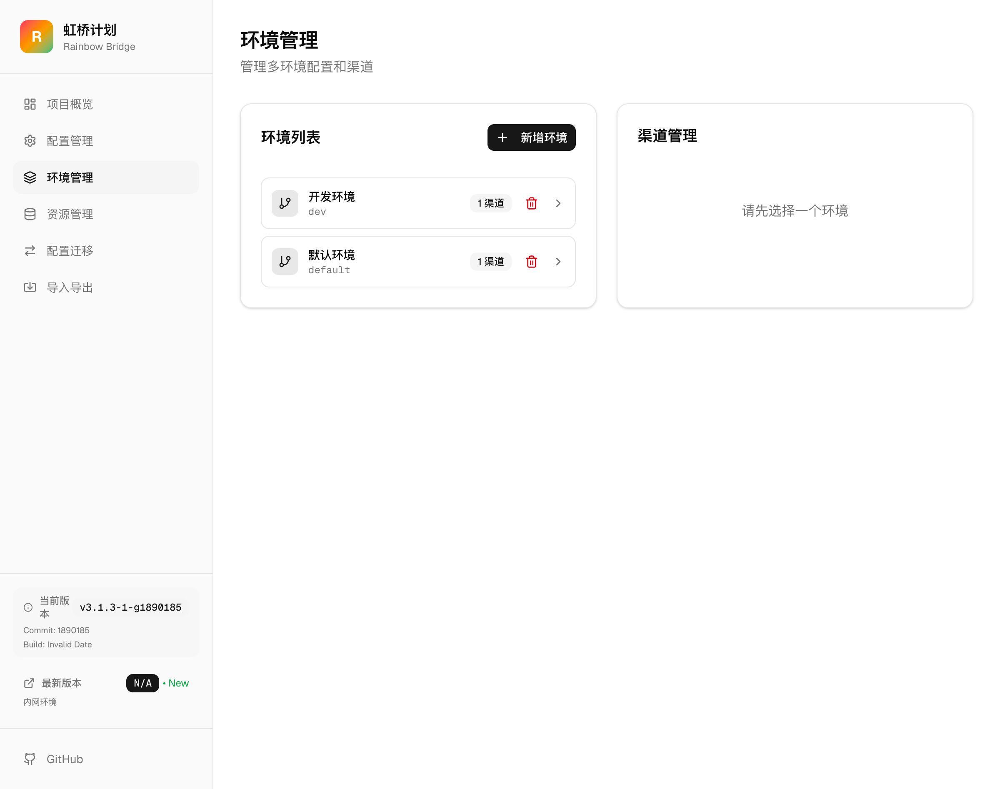
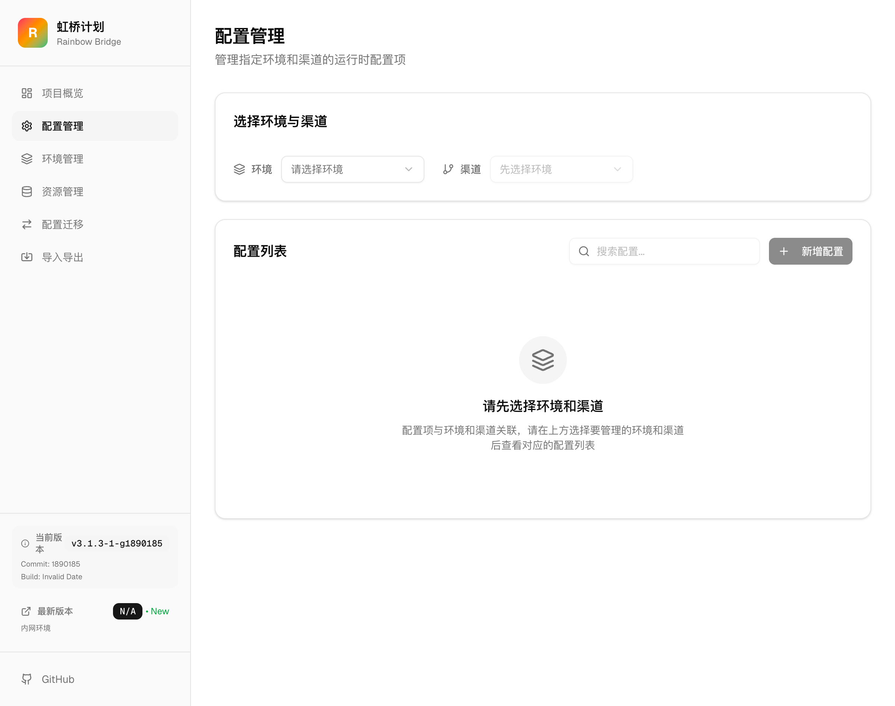
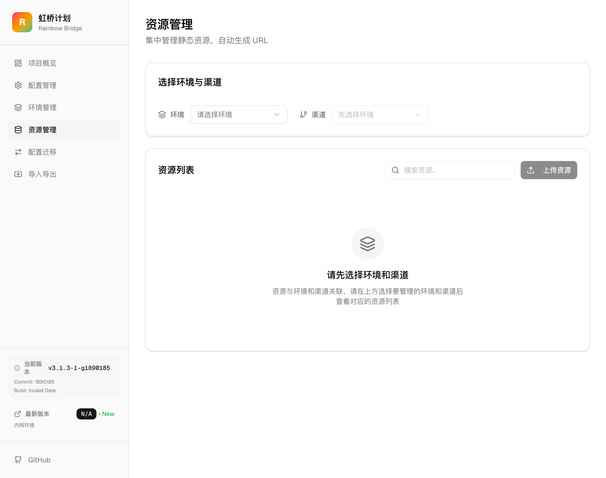

# 虹桥计划（Rainbow Bridge）技术设计文档

> **版本信息**  
> 版本：v3.1.3+  
> 最后更新：2026-03-07

## 目录

1. [项目概述](#项目概述)  
2. [快速开始](#快速开始)  
3. [UI 配置流程](#ui-配置流程)  
4. [平台对接指南](#平台对接指南)  
5. [系统目标](#系统目标)  
6. [架构总览](#架构总览)  
7. [核心模块设计](#核心模块设计)  
8. [数据模型](#数据模型)  
9. [关键业务流程](#关键业务流程)  
10. [接口与协议](#接口与协议)  
11. [配置与环境](#配置与环境)  
12. [构建与交付](#构建与交付)  
13. [部署与运行](#部署与运行)  
14. [安全与权限](#安全与权限)  
15. [日志、监控与告警](#日志监控与告警)  
16. [测试](#测试)  
17. [AI 辅助开发](#ai-辅助开发)  
18. [未来规划](#未来规划)  
19. [License](#license)

---

## 项目概述

虹桥计划（Rainbow Bridge）是一套自部署的"静态资源与配置管理"中台。项目名称灵感源自连接人界与天界的七彩虹桥，寓意为前端/客户端团队搭建一座高效、安全的资源传输通道。  

系统基于 **CloudWeGo Hertz**（HTTP 网关）+ **GORM**（ORM）+ **SQLite/MySQL/PostgreSQL**（关系型数据库）构建，提供以下核心能力：

- **多维度配置管理**：按环境（Environment）+ 渠道（Pipeline）双维度隔离配置，支持业务配置和系统配置；  
- **多种数据类型**：支持键值对（KV）、JSON 对象、纯文本、图片、色彩标签等 5 种配置类型；  
- **在线资源管理**：上传、预览、导出、导入静态资源；  
- **静态站点生成**：将配置打包成 Nginx 静态站点或 zip 包；  
- **实时 API 接口**：通过 REST 接口供业务系统实时读取配置。  

### 界面预览

#### 项目首页



*虹桥计划主页 - 展示项目简介、前端对接方式和运行时配置演示*

#### 环境管理



*环境管理页面 - 支持创建、编辑、删除环境和渠道，按维度隔离配置*

#### 配置管理



*配置管理页面 - 支持 5 种数据类型的配置增删改查，实时预览配置内容*

#### 资源管理



*资源管理页面 - 上传、预览、导出静态资源，支持多种文件格式*  

## 快速开始

### 1. 安装与部署

#### Docker 部署（推荐）

```bash
# 拉取最新镜像
docker pull ghcr.io/yi-nology/rainbow_bridge-api:latest
docker pull ghcr.io/yi-nology/rainbow_bridge-frontend:latest

# 使用 docker-compose 一键部署
cd deploy
docker compose up -d

# 访问管理控制台
open http://localhost:8080/rainbow-bridge
```

#### 本地运行

```bash
# 克隆项目
git clone https://github.com/yi-nology/rainbow_bridge.git
cd rainbow_bridge

# 启动服务（生产模式）
./build.sh
./output/bin/hertz_service --config config.yaml

# 或开发模式（支持热更新）
BUILD_MODE=dev ./build.sh
./output/bin/hertz_service --config config.yaml
```

### 2. 初始配置

首次启动后，系统会自动创建默认环境和渠道：
- **环境**：`default`（默认环境）
- **渠道**：`main`（主渠道）

你可以通过管理界面或 API 创建更多环境和渠道。

## 部署测试状态

本项目通过 GitHub Actions 自动运行部署测试，确保各种部署方式都能正常工作。

### 最新部署测试结果

<!-- deployment-status-start -->
| 部署方式 | 状态 | 最后成功时间 | 详情 |
|---------|------|------------|------|
| Docker Compose (SQLite) | 🟢 成功 | 最近一次 CI | [查看日志](../../actions) |
| Docker Compose (MySQL) | 🟢 成功 | 最近一次 CI | [查看日志](../../actions) |
| Kubernetes (Standalone) | 🟢 成功 | 最近一次 CI | [查看日志](../../actions) |
<!-- deployment-status-end -->

**状态说明**：
- 🟢 成功 - 最近一次部署测试通过
- 🔴 失败 - 最近一次部署测试失败
- 🟡 运行中 - 测试正在运行
- ⚪ 未测试 - 尚未运行测试

### 部署测试覆盖

#### Docker Compose 部署测试

测试场景包括：
- ✅ SQLite 数据库部署
- ✅ MySQL 数据库部署  
- ✅ PostgreSQL 数据库部署（待添加）
- ✅ MinIO 对象存储集群（待添加）

测试验证内容：
1. Docker 镜像构建成功
2. Docker Compose 服务启动正常
3. 健康检查接口响应 (`/ping`)
4. API 接口正常工作 (`/api/v1/version`)
5. 容器日志无严重错误

#### Kubernetes 部署测试

测试场景包括：
- ✅ Standalone 单节点部署
- ✅ PGSQL + MinIO 集群部署（待添加）

测试验证内容：
1. Docker 镜像加载到 Minikube
2. Kubernetes 资源创建成功（ConfigMap/Deployment/Service）
3. Pod 状态变为 Ready
4. Service 端口转发正常
5. 健康检查和 API 接口验证
6. Pod 日志无异常

### 手动运行部署测试

#### 本地测试 Docker Compose

```bash
# SQLite 部署测试
cd deploy/docker-compose/sqlite
docker compose up -d
sleep 30
curl http://localhost:8080/rainbow-bridge/ping
docker compose down

# MySQL 部署测试
cd deploy/docker-compose/mysql
docker compose up -d
sleep 60  # 等待 MySQL 初始化
curl http://localhost:8080/rainbow-bridge/ping
docker compose down
```

#### 本地测试 Kubernetes

```bash
# 启动 Minikube
minikube start

# 加载镜像
eval $(minikube docker-env)
docker build -t rainbow-bridge-api:k8s --target api .
docker build -t rainbow-bridge-frontend:k8s --target frontend .

# 部署到 K8s
cd deploy/kubernetes/standalone
kubectl apply -f configmap.yaml
kubectl apply -f deployment.yaml
kubectl apply -f service.yaml

# 等待 Pod 就绪
kubectl wait --for=condition=ready pod -l app=rainbow-bridge-api --timeout=120s
kubectl get pods

# 端口转发并测试
kubectl port-forward svc/rainbow-bridge-service 8080:80 &
sleep 5
curl http://localhost:8080/rainbow-bridge/ping

# 清理
kubectl delete -f deploy/kubernetes/standalone/
minikube stop
```

## UI 配置流程

本节详细介绍如何通过管理界面完成配置管理的全流程。

### 步骤 1：创建环境

环境用于隔离不同部署场景的配置（如开发、测试、生产）。

1. 访问 **环境管理** 页面 (`/environments`)
2. 点击 "新建环境" 按钮
3. 填写环境信息：
   - **环境标识**：唯一标识符，如 `dev`、`prod`
   - **环境名称**：友好显示名，如 "开发环境"
   - **备注**：可选说明信息
4. 点击 "确定" 保存


**最佳实践**：
- 为每个部署阶段创建独立环境（dev → test → staging → prod）
- 使用清晰的命名规范（如 `dev`, `test`, `prod-us`, `prod-eu`）
- 环境标识一旦创建不建议修改

### 步骤 2：创建渠道

渠道用于在同一环境下管理不同的功能分支或版本线。

1. 在环境列表中找到目标环境
2. 点击该环境的 "管理渠道" 按钮
3. 点击 "新建渠道"
4. 填写渠道信息：
   - **渠道标识**：唯一标识符，如 `main`、`feature-x`
   - **渠道名称**：友好显示名，如 "主渠道"
   - **备注**：可选说明信息
5. 点击 "确定" 保存

**使用场景**：
- `main`：生产发布渠道
- `hotfix`：紧急修复渠道
- `experiment`：实验性功能渠道
- `feature-xxx`：特定功能开发渠道

### 步骤 3：配置业务配置

业务配置是平台的核心功能，支持 5 种数据类型。

1. 访问 **配置管理** 页面 (`/config`)
2. 选择目标 **环境** 和 **渠道**
3. 点击 "新建配置" 按钮
4. 填写配置信息：

#### 3.1 键值对（Key-Value）类型

适用于简单的开关、数值等配置：

```
配置类型：键值对
配置内容：
{
  "max_retry_count": 3,
  "enable_cache": true,
  "timeout_ms": 5000
}
```

#### 3.2 JSON 对象类型

适用于复杂结构配置：

```
配置类型：JSON 对象
配置内容：
{
  "api_endpoints": {
    "user_service": "https://api.example.com/user",
    "order_service": "https://api.example.com/order"
  },
  "feature_flags": {
    "new_checkout": true,
    "dark_mode": false
  }
}
```

#### 3.3 纯文本类型

适用于文案、公告等：

```
配置类型：纯文本
配置内容：
欢迎使用虹桥计划配置管理平台！
```

#### 3.4 图片类型

适用于 Banner、图标等资源：

1. 先在 **资源管理** 页面上传图片
2. 选择图片类型配置
3. 从资源库中选择已上传的图片

#### 3.5 色彩标签类型

适用于主题色、状态色等：

```
配置类型：色彩标签
配置内容：#1677FF（Ant Design 蓝色）
```

5. 点击 "确定" 保存配置


### 步骤 4：管理静态资源

资源管理用于上传和管理图片、文件等静态资源。

1. 访问 **资源管理** 页面 (`/resources`)
2. 选择目标 **环境** 和 **渠道**
3. 点击 "上传资源" 按钮
4. 选择文件或拖拽到上传区域
5. 填写资源信息：
   - **所属业务**：资源归属的业务线
   - **备注**：资源说明
6. 上传完成后可预览、下载或删除

**支持的文件类型**：
- 图片：JPEG, PNG, GIF, WebP, SVG, BMP, ICO
- 字体：TTF, OTF, WOFF, WOFF2
- 文档：PDF, DOC, XLSX, PPTX
- 压缩包：ZIP, RAR, 7Z
- 音视频：MP3, MP4, WebM


### 步骤 5：导出配置

配置完成后，可以导出为静态包或 ZIP 文件。

#### 5.1 导出静态站点

1. 访问 **运行时配置** 页面
2. 选择目标 **环境** 和 **渠道**
3. 点击 "Export Static" 按钮
4. 系统将生成包含以下内容的 zip 包：
   - `config.json`：所有配置的 JSON 文件
   - `assets/`：引用的静态资源目录
   - `index.html`：可直接访问的静态页面

#### 5.2 导出 ZIP 包

1. 访问 **导入导出** 页面 (`/import-export`)
2. 选择 **导出** 标签页
3. 勾选要导出的环境和渠道
4. 点击 "导出选中配置"
5. 下载包含配置和资源的 ZIP 包

### 步骤 6：配置迁移

在不同环境或渠道间复制配置。

1. 访问 **配置迁移** 页面 (`/migration`)
2. 选择 **源环境/渠道**（配置来源）
3. 选择 **目标环境/渠道**（配置去向）
4. 系统自动比对差异：
   - 🆕 新配置：目标不存在
   - ⚠️ 冲突配置：内容不一致
   - ✅ 相同配置：无需迁移
5. 选择要迁移的配置项
6. 设置是否覆盖冲突
7. 点击 "执行迁移"

**典型场景**：
- 开发环境配置同步到测试环境
- 生产环境 hotfix 配置回滚
- 实验性功能配置合并到主渠道

## 平台对接指南

本节介绍如何在你的项目中集成虹桥计划配置平台。

### 1. 前端项目对接

#### 方式一：运行时 API 对接（推荐）

适用于需要实时获取配置的场景。

**步骤**：

1. **安装依赖**（如需要）
   ```bash
   # 无特殊依赖，使用原生 fetch 即可
   ```

2. **配置 API 客户端**
   ```javascript
   // lib/config-client.js
   const BASE_URL = 'http://localhost:8080/rainbow-bridge/api/v1';
   
   export async function getRuntimeConfig(environment, pipeline) {
     const response = await fetch(`${BASE_URL}/runtime/config`, {
       headers: {
         'x-environment': environment,
         'x-pipeline': pipeline
       }
     });
     
     if (!response.ok) {
       throw new Error(`HTTP error! status: ${response.status}`);
     }
     
     return await response.json();
   }
   ```

3. **在应用中使用**
   ```javascript
   // app/page.js
   import { getRuntimeConfig } from '@/lib/config-client';
   
   export default async function Page() {
     const config = await getRuntimeConfig('prod', 'main');
     
     return (
       <div>
         <h1>{config.system_config.app_name}</h1>
         <p>API 地址：{config.business_configs.api_base_url}</p>
       </div>
     );
   }
   ```

4. **React Hook 封装**（可选）
   ```javascript
   // hooks/use-config.js
   import { useEffect, useState } from 'react';
   
   export function useConfig(environment, pipeline) {
     const [config, setConfig] = useState(null);
     const [loading, setLoading] = useState(true);
     const [error, setError] = useState(null);
     
     useEffect(() => {
       async function loadConfig() {
         try {
           const data = await getRuntimeConfig(environment, pipeline);
           setConfig(data);
         } catch (err) {
           setError(err);
         } finally {
           setLoading(false);
         }
       }
       
       loadConfig();
     }, [environment, pipeline]);
     
     return { config, loading, error };
   }
   ```

#### 方式二：静态包部署

适用于配置变更不频繁的场景。

**步骤**：

1. **导出静态配置**
   - 在管理界面导出 `static.zip`
   - 解压到项目的 `public/config/` 目录

2. **读取配置文件**
   ```javascript
   // lib/config.js
   import configData from '../public/config/config.json';
   
   export const config = configData;
   
   export function getConfig(key, defaultValue = undefined) {
     return key.split('.').reduce((obj, k) => obj?.[k], configData) ?? defaultValue;
   }
   ```

3. **构建时注入**
   ```bash
   # 在 CI/CD 流程中，先调用 API 导出配置，再构建前端
   curl -o static.zip http://platform/rainbow-bridge/api/v1/runtime/static?environment_key=prod&pipeline_key=main
   unzip static.zip -d public/config/
   npm run build
   ```

### 2. 后端项目对接

#### Go 语言示例

```go
// config/client.go
package config

import (
    "encoding/json"
    "io/ioutil"
    "net/http"
)

type RuntimeConfig struct {
    SystemConfig   map[string]interface{} `json:"system_config"`
    BusinessConfigs map[string]interface{} `json:"business_configs"`
}

func GetRuntimeConfig(baseURL, env, pipeline string) (*RuntimeConfig, error) {
    req, err := http.NewRequest("GET", baseURL+"/api/v1/runtime/config", nil)
    if err != nil {
        return nil, err
    }
    
    req.Header.Set("x-environment", env)
    req.Header.Set("x-pipeline", pipeline)
    
    client := &http.Client{}
    resp, err := client.Do(req)
    if err != nil {
        return nil, err
    }
    defer resp.Body.Close()
    
    body, err := ioutil.ReadAll(resp.Body)
    if err != nil {
        return nil, err
    }
    
    var config RuntimeConfig
    err = json.Unmarshal(body, &config)
    return &config, err
}

// 使用示例
func main() {
    config, err := GetRuntimeConfig("http://localhost:8080/rainbow-bridge", "prod", "main")
    if err != nil {
        log.Fatal(err)
    }
    
    appName := config.SystemConfig["app_name"]
    fmt.Println("App Name:", appName)
}
```

#### Java/Spring Boot 示例

```java
// ConfigClient.java
@Service
public class ConfigClient {
    
    @Value("${rainbow.bridge.base-url}")
    private String baseUrl;
    
    private final RestTemplate restTemplate;
    
    public ConfigClient(RestTemplate restTemplate) {
        this.restTemplate = restTemplate;
    }
    
    public Map<String, Object> getRuntimeConfig(String environment, String pipeline) {
        HttpHeaders headers = new HttpHeaders();
        headers.set("x-environment", environment);
        headers.set("x-pipeline", pipeline);
        
        HttpEntity<Void> entity = new HttpEntity<>(headers);
        ResponseEntity<Map> response = restTemplate.exchange(
            baseUrl + "/api/v1/runtime/config",
            HttpMethod.GET,
            entity,
            Map.class
        );
        
        return response.getBody();
    }
}

// 使用示例
@RestController
public class MyController {
    
    @Autowired
    private ConfigClient configClient;
    
    @GetMapping("/api/info")
    public ResponseEntity<?> getInfo() {
        Map<String, Object> config = configClient.getRuntimeConfig("prod", "main");
        return ResponseEntity.ok(config);
    }
}
```

### 3. 移动端对接

#### iOS (Swift)

```swift
// ConfigClient.swift
class ConfigClient {
    static let shared = ConfigClient()
    private let baseURL = "http://localhost:8080/rainbow-bridge/api/v1"
    
    func getRuntimeConfig(environment: String, pipeline: String, completion: @escaping (Result<Config, Error>) -> Void) {
        var request = URLRequest(url: URL(string: "\(baseURL)/runtime/config")!)
        request.setValue(environment, forHTTPHeaderField: "x-environment")
        request.setValue(pipeline, forHTTPHeaderField: "x-pipeline")
        
        URLSession.shared.dataTask(with: request) { data, response, error in
            guard let data = data, error == nil else {
                completion(.failure(error ?? URLError(.badServerResponse)))
                return
            }
            
            do {
                let config = try JSONDecoder().decode(Config.self, from: data)
                completion(.success(config))
            } catch {
                completion(.failure(error))
            }
        }.resume()
    }
}

struct Config: Codable {
    let systemConfig: [String: Any]
    let businessConfigs: [String: Any]
}
```

#### Android (Kotlin)

```kotlin
// ConfigClient.kt
class ConfigClient(private val apiService: ConfigApiService) {
    
    suspend fun getRuntimeConfig(environment: String, pipeline: String): Config {
        val call = apiService.getRuntimeConfig(environment, pipeline)
        val response = call.execute()
        
        if (response.isSuccessful) {
            return response.body() ?: throw Exception("Empty response")
        } else {
            throw Exception("HTTP error: ${response.code()}")
        }
    }
}

interface ConfigApiService {
    @GET("api/v1/runtime/config")
    fun getRuntimeConfig(
        @Header("x-environment") environment: String,
        @Header("x-pipeline") pipeline: String
    ): Call<Config>
}
```

### 4. API 接口参考

完整 API 文档请参考 [接口与协议](#接口与协议) 章节。

**核心接口**：

| 接口 | 方法 | 说明 | 示例 |
|------|------|------|------|
| `/api/v1/runtime/config` | GET | 获取运行时配置 | `curl -H "x-env: prod" /api/v1/runtime/config` |
| `/api/v1/config/list` | GET | 获取配置列表 | `?environment_key=prod&pipeline_key=main` |
| `/api/v1/asset/list` | GET | 获取资源列表 | `?environment_key=prod&pipeline_key=main` |
| `/api/v1/asset/upload` | POST | 上传资源 | Multipart/form-data |
| `/api/v1/runtime/static` | GET | 导出静态包 | `?environment_key=prod&pipeline_key=main` |

### 5. 环境变量配置

不同环境的推荐配置：

```bash
# 开发环境 (.env.development)
NEXT_PUBLIC_API_BASE_URL=http://localhost:8080/rainbow-bridge
NEXT_PUBLIC_ENVIRONMENT=dev
NEXT_PUBLIC_PIPELINE=main

# 测试环境 (.env.test)
NEXT_PUBLIC_API_BASE_URL=https://test-platform.example.com/rainbow-bridge
NEXT_PUBLIC_ENVIRONMENT=test
NEXT_PUBLIC_PIPELINE=main

# 生产环境 (.env.production)
NEXT_PUBLIC_API_BASE_URL=https://platform.example.com/rainbow-bridge
NEXT_PUBLIC_ENVIRONMENT=prod
NEXT_PUBLIC_PIPELINE=main
```

### 6. 最佳实践

#### 配置组织

- ✅ 按功能模块分组配置（如 `api.*`, `ui.*`, `feature.*`）
- ✅ 使用有意义的配置名称（如 `api_base_url` 而非 `url1`）
- ✅ 为配置添加详细备注说明用途
- ❌ 避免配置过多层级（建议不超过 3 层）

#### 环境管理

- ✅ 保持环境间配置一致性（使用配置迁移功能）
- ✅ 定期清理废弃的环境和渠道
- ✅ 为重要配置开启审计日志
- ❌ 避免在生产环境直接修改配置（应通过迁移流程）

#### 资源管理

- ✅ 使用语义化的文件名
- ✅ 按业务分类组织资源
- ✅ 定期清理未使用的资源
- ❌ 避免上传超大文件（建议 < 10MB）

#### 性能优化

- ✅ 使用浏览器缓存运行时配置
- ✅ 对配置数据实施 CDN 加速
- ✅ 批量获取配置减少请求次数
- ❌ 避免频繁轮询配置接口

## 系统目标

1. **多维度配置管理**：以环境（Environment）+ 渠道（Pipeline）为维度管理配置，支持业务配置和系统配置；  
2. **统一交付产物**：支持导出 `static/config.json`、zip 包和 Docker 镜像，方便静态部署；  
3. **多种数据类型**：支持键值对、JSON 对象、文本、图片、颜色等多种配置类型，满足不同场景需求；  
4. **兼容多存储后端**：默认内置 SQLite，易于扩展到 MySQL/PGSQL 或对象存储；  
5. **可观测性**：预留鉴权、审计、监控接口，支持权限扩展能力。  

## 架构总览

```
               ┌───────────────────────────────┐
               │           Web Console         │
               │ (HTML/CSS/JS 静态管理界面)      │
               └──────────────┬────────────────┘
                              │ HTTP (REST)
                   ┌──────────▼───────────┐
                   │   CloudWeGo Hertz    │
                   │  (biz/router, handler│
                   │   & resourcepb handler)│
                   └──────────┬───────────┘
                              │
                ┌─────────────▼─────────────┐
                │        Service 层          │
                │ (biz/service/resource)     │
                └─────────────┬─────────────┘
                              │
                ┌─────────────▼─────────────┐
                │   DAO & 数据访问层        │
                │  (biz/dal/resource)       │
                └─────────────┬─────────────┘
                              │
                ┌─────────────▼─────────────┐
                │   数据库 + 文件存储       │
                │  SQLite/MySQL/PGSQL       │
                │  data/uploads/ 目录       │
                └───────────────────────────┘
```

同时，项目提供 GitHub Actions 工作流（`.github/workflows/release.yml`）实现多平台编译与 Docker 镜像构建：

- Go 交叉编译产物：`linux/windows/darwin` + `amd64/arm64`；  
- Docker 镜像：`linux/amd64`、`linux/arm64` 多架构推送至 GHCR。  

## 核心模块设计

### 1. 路由层（Router）

`biz/router/` 按功能模块划分，每个模块独立注册路由：

- **模块化路由**：
  - `environment/` - 环境管理路由
  - `pipeline/` - 渠道管理路由
  - `config/` - 配置管理路由
  - `asset/` - 静态资源路由
  - `runtime/` - 运行时配置路由
  - `transfer/` - 配置迁移路由
  - `version/` - 版本信息路由

- **统一注册**：`register.go` 负责初始化所有 handler 并注册路由到 Hertz 实例
- **入口文件**：`main.go` 加载配置、初始化数据库、注册路由和静态资源

### 2. Handler 层

`biz/handler/` 按模块划分，处理 HTTP 请求和响应：

- **模块化 Handler**：
  - `environment/environment_service.go` - 环境管理接口实现
  - `pipeline/pipeline_service.go` - 渠道管理接口实现
  - `config/config_service.go` - 配置管理接口实现
  - `asset/asset_service.go` - 静态资源上传、下载接口
  - `runtime/runtime_service.go` - 运行时配置获取、静态包导出
  - `transfer/transfer_service.go` - 配置导入导出接口
  - `version/version_service.go` - 版本信息接口

- **公共模块**：
  - `common.go` - 通用响应封装、错误处理、摘要生成
  - `ping.go` - 健康检查接口

### 3. Service 层

`biz/service/` 负责业务逻辑编排和数据转换：

- **核心服务文件**：
  - `service.go` - Service 结构体定义，封装数据库连接和通用方法
  - `config_service.go` - 配置增删改查逻辑
  - `asset_service.go` - 静态资源上传、列表查询逻辑
  - `runtime_service.go` - 运行时配置获取、静态包生成逻辑
  - `transfer_service.go` - 配置导入导出、ZIP 打包解析逻辑
  - `environment_service.go` - 环境管理逻辑
  - `pipeline_service.go` - 渠道管理逻辑

- **业务逻辑层**：
  - `logic.go` - 通用业务逻辑（环境和渠道管理）
  - `logic_config.go` - 配置验证、装饰、过滤逻辑
  - `logic_asset.go` - 资源引用解析、路径处理
  - `logic_environment.go` - 环境相关业务规则

- **初始化与测试**：
  - `seed.go` - 系统初始化（默认环境和渠道）
  - `service_test.go` - 单元测试覆盖

### 4. 数据访问层（DAO）

`biz/dal/db/` 提供面向 GORM 的 CRUD 封装：

- `environment_dao.go` - 环境表数据访问
- `pipeline_dao.go` - 渠道表数据访问
- `config_dao.go` - 配置表增删改查、按资源键查询
- `asset_dao.go` - 静态资源表增删改查、按环境渠道查询

### 5. 模型层

**数据库实体模型**（`biz/dal/model/`）：
- `environment.go` - 环境表实体
- `pipeline.go` - 渠道表实体
- `config.go` - 配置表实体
- `asset.go` - 静态资源表实体

**Protobuf 生成模型**（`biz/model/`）：
- `common/common.pb.go` - 通用消息类型（ResourceConfig、FileAsset 等）
- `environment/environment.pb.go` - 环境管理消息
- `pipeline/pipeline.pb.go` - 渠道管理消息
- `config/config.pb.go` - 配置消息
- `asset/asset.pb.go` - 静态资源消息
- `runtime/runtime.pb.go` - 运行时配置消息
- `transfer/transfer.pb.go` - 配置导入导出消息
- `version/version.pb.go` - 版本信息消息
- `api/api.pb.go` - API 路由注解定义

**注意**：所有 `*.pb.go` 文件由 `hz` 工具根据 `idl/` 目录下的 proto 文件自动生成，不应手动修改。

### 6. 前端界面

前端使用 **React + Next.js** 框架构建现代化的管理界面，位于 `react/` 目录：

#### 页面模块

- **app/page.tsx** - 项目首页，展示简介和对接说明
- **app/environments/page.tsx** - 环境管理页面
- **app/config/page.tsx** - 配置管理页面（支持环境/渠道切换）
- **app/resources/page.tsx** - 静态资源库管理
- **app/import-export/page.tsx** - 配置导入导出页面
- **app/migration/page.tsx** - 配置迁移页面（多环境/渠道同步）

#### 核心组件

- **components/app-sidebar.tsx** - 侧边栏导航
- **components/runtime-config.tsx** - 运行时配置展示
- **components/project-intro.tsx** - 项目介绍组件
- **components/api-docs.tsx** - API 文档展示
- **components/ui/** - 基于 shadcn/ui 的通用 UI 组件

#### API 客户端

- **lib/api/** - API 请求封装，对应后端各模块
  - `config.ts` - 配置管理 API
  - `environment.ts` - 环境管理 API
  - `asset.ts` - 资源管理 API
  - `transfer.ts` - 导入导出 API
  - `runtime.ts` - 运行时配置 API
  - `version.ts` - 版本信息 API

#### 数据管理

- **hooks/** - React Query 自定义 Hooks
  - `use-configs.ts` - 配置数据管理
  - `use-environments.ts` - 环境数据管理
  - `use-assets.ts` - 资源数据管理
  - `use-version.ts` - 版本信息管理

#### 技术栈

- **框架**：Next.js 16 + React 19
- **状态管理**：React Query（TanStack Query）
- **UI 组件**：shadcn/ui + Radix UI
- **样式**：Tailwind CSS
- **表单验证**：React Hook Form + Zod
- **构建工具**：Turbopack


## 数据模型

### 1. 环境表 `Environment`

| 字段              | 类型     | 说明                                      |
|-------------------|----------|-------------------------------------------------|
| `environment_key` | string   | 环境唯一标识，例如 `dev`、`prod`            |
| `environment_name`| string   | 环境名称，例如 "开发环境"、"生产环境"        |
| `remark`          | string   | 备注信息                                      |
| `created_at`      | datetime | 创建时间                                      |
| `updated_at`      | datetime | 更新时间                                      |

### 2. 渠道表 `Pipeline`

| 字段              | 类型     | 说明                                      |
|-------------------|----------|-------------------------------------------------|
| `environment_key` | string   | 所属环境                                      |
| `pipeline_key`    | string   | 渠道唯一标识，例如 `main`、`feature-x` |
| `pipeline_name`   | string   | 渠道名称                                  |
| `remark`          | string   | 备注信息                                      |
| `created_at`      | datetime | 创建时间                                      |
| `updated_at`      | datetime | 更新时间                                      |

**联合唯一约束**：`(environment_key, pipeline_key)`

### 3. 配置表 `Config`

| 字段              | 类型     | 说明                                      |
|-------------------|----------|-------------------------------------------------|
| `resource_key`    | string   | 资源唯一标识                                  |
| `environment_key` | string   | 所属环境                                      |
| `pipeline_key`    | string   | 所属渠道                                  |
| `name`            | string   | 名称，例如 `api_base_url`，**可随时修改**              |
| `alias`           | string   | 别名/描述，**创建后不可修改**                                 |
| `content`         | text     | 配置内容（JSON 字符串 / 文本 / 引用）      |
| `type`            | varchar  | 数据类型：`text`、`number`、`boolean`、`object`、`image`、`color` 等 |
| `remark`          | string   | 备注信息                                      |
| `created_at`      | datetime | 创建时间                                      |
| `updated_at`      | datetime | 更新时间                                      |

**联合唯一约束**：`(resource_key, environment_key, pipeline_key, name)`

**字段编辑规则**：
- `name`（名称）：可以随时修改，用于展示和引用
- `alias`（别名）：只能在创建时设置，创建后**不可修改**，确保配置标识的稳定性
- 前端编辑界面会自动禁用别名字段，后端通过 `Omit("alias")` 保护该字段

**数据类型说明**：
- `text`：纯文本，适用于字符串配置
- `number`：数值类型，整数或小数
- `boolean`：布尔值（true/false）
- `json`/`object`：JSON 对象，复杂配置数据
- `keyvalue`：键值对，存储为 JSON 对象
- `image`：图片资源引用
- `color`：颜色值（如 `#1677FF`）

### 4. 业务配置表 `Config`

| 字段          | 类型      | 说明                                |
|---------------|-----------|-------------------------------------|
| `resource_key`| string    | 资源唯一标识，默认 UUID             |
| `environment_key` | string | 所属环境                          |
| `pipeline_key`    | string | 所属渠道                        |
| `alias`       | string    | 别名，同一环境+渠道下唯一        |
| `name`        | string    | 名称                            |
| `type`        | enum      | 数据类型：`kv`、`config`、`text`、`image`、`color`|
| `content`     | text      | 配置内容（JSON 字符串 / 文本 / 引用）|
| `remark`      | string    | 备注信息                            |
| `is_perm`     | bool      | 是否属于权限配置                    |
| `created_at`  | datetime  | 创建时间                            |
| `updated_at`  | datetime  | 更新时间                            |

**联合唯一约束**：`(environment_key, pipeline_key, alias)`

### 5. 资源表 `Asset`

| 字段          | 类型    | 说明                                   |
|---------------|---------|----------------------------------------|
| `file_id`     | string  | 文件唯一 ID（UUID）                    |
| `business_key`| string  | 所属业务                                |
| `file_name`   | string  | 原始文件名                             |
| `content_type`| string  | Content-Type，用于下载时设置 MIME      |
| `file_size`   | int64   | 文件大小                               |
| `path`        | string  | 存储路径，相对 `data/` 目录            |
| `url`         | string  | 下载 URL（默认 `/api/v1/asset/file/{file_id}`，响应会自动补上 `server.base_path`） |
| `remark`      | string  | 备注                                   |
| `created_at`/`updated_at` | datetime | 创建/更新时间           |

SQLite 默认存储在 `data/resource.db`，静态文件默认落盘至 `data/uploads/`。

## 关键业务流程

### 1. 运行时配置获取

1. 客户端访问 `GET /api/v1/runtime/config`，通过 Header 传递 `x-environment` 和 `x-pipeline`；  
2. Handler 解析 Header 参数，调用 Service 查询配置列表；  
3. Service 根据环境和渠道查询系统配置和业务配置；  
4. DAO 利用 GORM 访问数据库，返回最新配置；  
5. Handler 将结果包装成 JSON 响应，包含配置列表和环境信息。

### 2. 静态资源上传

1. 前端通过 `POST /api/v1/asset/upload` 提交 multipart-form，携带 `environment_key` 和 `pipeline_key`；  
2. Handler 读取文件数据，调用 `Service.UploadAsset`；  
3. Service 将文件写入 `data/uploads/{file_id}/` 并创建数据库记录；  
4. 返回 `asset://{file_id}` 引用及资源元数据；  
5. 配置内容中可引用 `asset://` 前缀，导出时会自动替换为静态文件路径。

### 3. 静态包导出

1. 前端触发 `GET /api/v1/runtime/static?environment_key=xxx&pipeline_key=xxx`；  
2. Service 拉取配置与资源，生成 zip 包：  
   - `config.json`：系统配置和业务配置合并的 JSON；  
   - `assets/{file_id}/{filename}`：静态资源文件；  
3. 返回 zip 文件供用户下载，可直接部署到 Nginx 或 CDN。

### 4. 配置迁移（多环境/渠道同步）

1. 前端访问 `/migration` 页面，选择源环境/渠道和目标环境/渠道；  
2. 调用 `GET /api/v1/config/list` 获取源配置列表和目标配置列表；  
3. 前端自动比对差异：
   - 标记新配置（目标不存在）
   - 标记冲突配置（内容不一致）
   - 显示配置详情和差异对比
4. 用户选择要迁移的配置，设置是否覆盖冲突；  
5. 调用 `POST /api/v1/transfer/migrate` 执行迁移：
   - Service 验证环境和渠道存在性
   - 复制配置到目标（生成新 resource_key）
   - 自动复制关联的资源文件（如图片）
   - 根据 `overwrite` 参数决定是否覆盖已存在配置
6. 返回迁移结果（成功/跳过/失败数量及详情）；  
7. 前端展示迁移结果，支持重新开始。

## 接口与协议

### 1. REST 接口

项目接口按功能模块划分，每个模块由独立的 protobuf 定义：

#### 环境管理 (`/api/v1/environment/*`)
- `GET /api/v1/environment/list` - 获取环境列表
- `POST /api/v1/environment/create` - 创建环境
- `POST /api/v1/environment/update` - 更新环境
- `POST /api/v1/environment/delete` - 删除环境

#### 渠道管理 (`/api/v1/pipeline/*`)
- `GET /api/v1/pipeline/list` - 获取渠道列表（需传 `environment_key`）
- `POST /api/v1/pipeline/create` - 创建渠道
- `POST /api/v1/pipeline/update` - 更新渠道
- `POST /api/v1/pipeline/delete` - 删除渠道

#### 配置 (`/api/v1/config/*`)
- `GET /api/v1/config/list` - 获取配置列表
- `POST /api/v1/config/create` - 创建配置
- `POST /api/v1/config/update` - 更新配置
- `POST /api/v1/config/delete` - 删除配置
- `GET /api/v1/config/detail` - 获取配置详情

#### 静态资源 (`/api/v1/asset/*`)
- `GET /api/v1/asset/list` - 获取资源列表（需传 `environment_key` 和 `pipeline_key`）
- `POST /api/v1/asset/upload` - 上传静态资源（multipart-form）
- `GET /api/v1/asset/file/{file_id}` - 下载静态资源文件

#### 运行时配置 (`/api/v1/runtime/*`)
- `GET /api/v1/runtime/config` - 获取运行时配置（通过 Header `x-environment` 和 `x-pipeline`）
- `GET /api/v1/runtime/static` - 导出静态包（需传 `environment_key` 和 `pipeline_key`）

#### 配置迁移 (`/api/v1/transfer/*`)
- `POST /api/v1/transfer/export` - 选择性导出配置（POST body 包含选择的环境/渠道/配置）
- `GET /api/v1/transfer/export-tree` - 获取导出树形结构（展示所有环境、渠道和配置数量）
- `POST /api/v1/transfer/import` - 导入配置（支持 JSON 和 ZIP 格式）
- `POST /api/v1/transfer/import-preview` - 导入预览（分析文件内容，检测冲突）
- `POST /api/v1/transfer/import-selective` - 选择性导入（从归档文件中选择部分配置导入）
- `POST /api/v1/transfer/migrate` - 配置迁移（在不同环境/渠道间复制配置）

#### 版本信息 (`/api/v1/version`)
- `GET /api/v1/version` - 获取系统版本信息

### 2. Protobuf 定义

接口实现基于 CloudWeGo Hertz + Protobuf，定义位于 `idl/biz/` 目录：
- `environment.proto` - 环境管理
- `pipeline.proto` - 渠道管理
- `config.proto` - 配置管理
- `asset.proto` - 静态资源
- `runtime.proto` - 运行时配置
- `transfer.proto` - 配置导入导出
- `version.proto` - 版本信息

生成代码：`hz update -idl idl/biz/*.proto`

### 3. 鉴权与扩展

- 运行时配置接口通过 `x-environment` 和 `x-pipeline` Header 传递环境和渠道信息
- 其他接口通过 Query 参数或 Request Body 传递 `environment_key` 和 `pipeline_key`
- 未来可扩展统一鉴权中间件（Token / OAuth2 / API Key 等）

## 配置与环境

### 1. 服务配置

- `config.yaml`：主配置文件，包含 `server.address`、`database` 等；
- `server.base_path`：可选的统一访问前缀（如 `/rainbow-bridge`），启用后 API、静态控制台与返回的资源 URL 会自动携带该前缀，便于部署在反向代理或多租户网关之下；
  - 配置优先级：配置文件 > 环境变量 `BASE_PATH` > 编译时参数
  - 留空表示部署在根路径
- 若文件缺失，程序会使用默认配置（监听 `:8080`，使用 `sqlite` & `data/resource.db`）；
- `main.go` 启动流程：
  1. 加载配置；  
  2. 初始化数据库与自动迁移（Config/Asset 表）；  
  3. 执行 `EnsureSystemDefaults` 写入默认系统配置；  
  4. 注册路由与静态前端资源。

若切换数据库，可更新 `config.yaml` 中的 DSN 并确保对应驱动依赖（MySQL/PGSQL）。

### 2. 前端配置

前端使用 Next.js 框架，支持通过环境变量配置 `basePath`：

- **开发环境**：`.env.development` 中设置 `NEXT_PUBLIC_BASE_PATH`（默认为空）
- **生产环境**：`.env.production` 中设置 `NEXT_PUBLIC_BASE_PATH`（如 `/rainbow-bridge`）
- **构建时注入**：GitHub Actions 或本地构建脚本通过 `BASE_PATH` 变量注入
- **配置方式**：
  ```bash
  # 开发环境
  cd react && npm run dev
  
  # 构建时指定 basePath
  BASE_PATH=/rainbow-bridge npm run build
  ```

前端会自动从环境变量读取 `basePath` 并应用到：
- Next.js 路由配置
- API 请求路径
- 静态资源路径（包括图标）

## 构建与交付

### 1. 本地构建

#### 后端构建

项目支持两种构建模式，适应不同场景需求：

**生产模式（默认）** - 静态文件嵌入到二进制，适合 Docker 部署和发布：
```bash
# 普通构建
go build -o output/local/hertz_service .

# 或使用构建脚本
./build.sh
```

**开发模式** - 从文件系统动态加载静态文件，支持热更新：
```bash
# 使用 BUILD_MODE 环境变量
BUILD_MODE=dev ./build.sh

# 或直接使用 go build
go build -tags=dev -o output/local/hertz_service .
```

**交叉编译脚本**：
- `script/build_cross.sh`：一次性编译多个 OS/ARCH；  
- `script/build_linux_amd64.sh`：专用于 Linux amd64，可在 macOS 上通过 `zig` 或 cross gcc 构建 CGO 版本（用于 SQLite）。

**构建模式对比**：

| 模式 | 命令 | 静态文件来源 | 适用场景 |
|------|------|-------------|----------|
| 生产模式 | `./build.sh` | 嵌入到二进制 | Docker 部署、Release 发布 |
| 开发模式 | `BUILD_MODE=dev ./build.sh` | 文件系统 (`react/out`) | 本地开发、前端调试 |

#### 前端构建

- 开发模式：
  ```bash
  cd react && npm run dev
  ```

- 生产构建：
  ```bash
  cd react && npm run build
  ```

- 带 basePath 的生产构建：
  ```bash
  cd react && BASE_PATH=/rainbow-bridge npm run build
  ```

前端构建产物位于 `react/out/` 目录，后端会在启动时自动挂载该目录。

### 2. GitHub Actions

`.github/workflows/release.yml` 在推送 `v*` 标签时执行，采用模块化设计：

**可复用 Workflow**：
- `build-binaries.yml` - 多平台二进制构建（Linux/Windows/macOS × amd64/arm64）
- `build-docker-api.yml` - Docker API 镜像构建
- `build-docker-frontend.yml` - Docker 前端镜像构建

**主流程**：
1. **并行构建**：三个 workflow 可同时运行，加快构建速度；  
2. **发布 Release**：聚合二进制产物并上传到 GitHub Release；  
3. **Docker 多架构构建**：借助 Buildx + QEMU，通过 GHCR 推送 `linux/amd64` 与 `linux/arm64` 镜像，支持 `latest` 及 tag 对应版本。

**优势**：
- ✅ 模块化设计，每个 action 职责单一
- ✅ 可复用，其他 workflow 可通过 `workflow_call` 单独调用
- ✅ 并行执行，提升 CI 效率
- ✅ 灵活配置，支持独立触发

### 3. Docker 支持

Dockerfile（未贴出）可结合上述多架构构建，支持容器化部署。镜像默认推送至 `ghcr.io/{owner}/rainbow_bridge`。

## 部署与运行

1. **依赖环境**：Go 1.22+、CGO（若使用 SQLite 且交叉编译）、可选的对象存储；  
2. **目录结构**：  
   - `data/resource.db`：默认 SQLite DB；  
   - `data/uploads/`：静态文件存储；  
   - `output/`：编译产物目录；  
3. **运行命令**：  
   ```bash
   ./hertz_service --config config.yaml
   ```
   或 Docker 方式运行指定镜像。

4. **静态站点部署**：`Export Static` 功能产出的 `static/config.json` + `static/assets/` 可直接丢到任意静态服务器（Nginx、CDN）。

### Docker Compose

仓库在 `deploy/docker-compose.yaml` 中提供了单实例 Compose 部署示例：

```bash
cd deploy
docker compose up -d
```

默认会挂载 `deploy/docker-compose/config.yaml` 作为容器内配置文件，并使用命名卷 `rainbow_bridge_data` 存储数据库/上传内容。需要自定义前置 Nginx 时，可参见 `deploy/nginx/` 提供的独立配置示例，根据环境将其部署为单独的容器或主机服务。根据需要修改 config、端口映射或卷路径即可。

### Nginx 代理示例

`deploy/nginx/` 目录包含 `rainbow-bridge.conf` 及使用说明，适用于容器化或物理机场景。默认将 `/rainbow-bridge/` 前缀代理到后端 8080 端口，并保留 gzip、302 重定向等设置，如需 HTTPS 或鉴权可自行扩展。

### 自动提示打 Tag

仓库提供 `script/auto_tag.sh` 和 `.githooks/post-commit`，用于在每次提交后交互式询问是否根据语义化版本（大版本/小版本/补丁）创建 Git tag。

启用方式：

```bash
git config core.hooksPath .githooks
chmod +x .githooks/post-commit script/auto_tag.sh
```

之后每次 `git commit` 完成都会提示是否打 tag，并可选择是否立即推送到 `origin`。在 CI 等非交互环境会自动跳过。

## 安全与权限

- 当前版本支持通过 `X-User-Id` 传递用户 ID，Service 层可依据 `is_perm` 字段限制普通用户访问。  
- 建议对外接口前加接入层（API 网关）或自定义认证中间件：  
  - Token / HMAC；  
  - OAuth2 / SSO；  
  - IP 白名单等。  
- 重要操作（删除、导入覆盖）应记录审计日志，可扩展到消息队列/日志中心。

## 日志监控与告警

- Hertz 默认提供基础日志，可结合 `logrus`/`zap` 接入结构化日志；  
- 数据库错误、文件系统异常均会返回 500，建议对接 Prometheus/Grafana 监控；  
- 可引入 Sentry/ELK stack 捕获 panic 或错误日志。

## 测试

项目包含完整的测试套件，覆盖单元测试、集成测试、E2E 测试和性能测试。

### 测试类型

#### 1. 后端单元测试

```bash
# 运行所有测试
go test ./...

# 带覆盖率报告
go test -v -race -coverprofile=coverage.out -covermode=atomic ./...
go tool cover -html=coverage.out
```

**已实现**：
- ✅ DAO 层测试（Environment DAO 完整覆盖）
- ✅ 测试工具库（`biz/dal/db/testutil.go`）
- ⏳ Service 层、Handler 层测试（待扩展）

#### 2. E2E 测试（Playwright）

```bash
cd tests/e2e

# 安装依赖（首次运行）
npm install
npx playwright install

# 运行测试
npm test

# 查看测试报告
npm run test:report
```

**已实现**：
- ✅ 环境管理流程测试
- ⏳ 配置 CRUD、资源上传、配置迁移（待扩展）

#### 3. 性能测试（k6）

```bash
# 安装 k6
# macOS: brew install k6
# Linux: 参考 https://k6.io/docs/getting-started/installation/

# 运行性能测试
k6 run tests/performance/api-load-test.js

# 查看性能报告
open tests/performance/reports/summary.html
```

**性能目标**：
- 响应时间（p95）< 500ms
- 错误率 < 10%
- 支持 50+ 并发用户

### CI/CD 测试集成

GitHub Actions 自动运行：
- ✅ 后端单元测试（每次 PR/Push）
- ✅ E2E 测试（每次 PR/Push）
- ✅ 性能测试（main 分支或 `[perf]` 标记）
- ✅ 代码质量检查（golangci-lint）

### 详细文档

完整的测试指南请参考 [TESTING.md](TESTING.md)，包括：
- 测试环境搭建
- 编写测试用例
- 最佳实践
- 故障排查
- 贡献指南

## AI 辅助开发

项目包含 AI 开发指南（`AGENT.md`）和编码规范（`CODING_STANDARDS.md`），帮助 AI 更好地理解和贡献代码。

## 未来规划

1. **对象存储适配**：支持 AWS S3/阿里云 OSS 等，提升高可用；  
2. **鉴权与审计**：与公司统一的 IAM/权限系统集成；  
3. ~~**多环境渠道**：支持资源多环境同步、差异比对~~（**已完成** ✅ - `/migration` 页面提供配置迁移功能）；  
4. **更友好的前端体验**：配置 Diff、资产预览、批量操作；  
5. ~~**自动化测试覆盖**：完善端到端测试、性能测试~~（**已完成** ✅ - 完整测试套件已实现）；  
6. **消息通知**：导入导出结果通过邮件/IM 通知。

## License

本项目遵循 [Apache License 2.0](LICENSE)。
