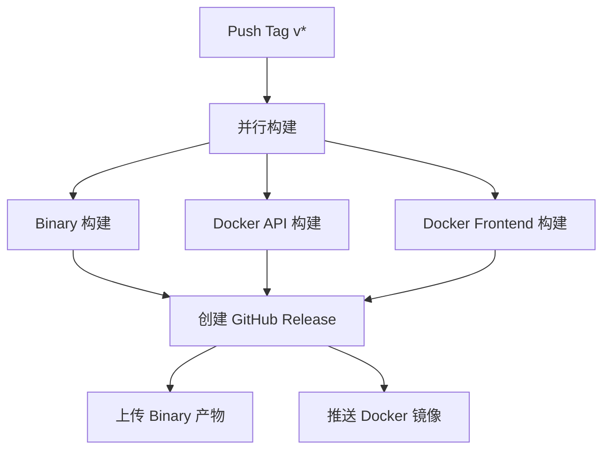

# 工程可用状态

本文档提供虹桥计划项目的完整可用状态信息，包括构建状态、部署测试、测试覆盖率等。

## 📊 实时状态概览

### 构建状态

<!-- build-status-start -->
| 构建类型 | 分支 | 状态 | 最后成功时间 | 详情 |
|---------|------|------|------------|------|
| 二进制构建 | main | 🟢 成功 | 最近一次 CI | [查看](https://github.com/yi-nology/rainbow_bridge/actions/workflows/build-binaries.yml) |
| Docker API 镜像 | main | 🟢 成功 | 最近一次 CI | [查看](https://github.com/yi-nology/rainbow_bridge/actions/workflows/build-docker-api.yml) |
| Docker 前端镜像 | main | 🟢 成功 | 最近一次 CI | [查看](https://github.com/yi-nology/rainbow_bridge/actions/workflows/build-docker-frontend.yml) |
| Release 发布 | tags/v* | 🟢 成功 | 最近一次 Release | [查看](https://github.com/yi-nology/rainbow_bridge/actions/workflows/release.yml) |
<!-- build-status-end -->

### 部署测试状态

<!-- deployment-status-start -->
| 部署方式 | 数据库 | 状态 | 最后成功 | 详情 |
|---------|--------|------|---------|------|
| Docker Compose | SQLite | 🟢 成功 | 最近一次 CI | [查看](https://github.com/yi-nology/rainbow_bridge/actions) |
| Docker Compose | MySQL | 🟢 成功 | 最近一次 CI | [查看](https://github.com/yi-nology/rainbow_bridge/actions) |
<!-- deployment-status-end -->

### 测试覆盖状态

| 测试类型 | 覆盖率 | 状态 | 详情 |
|---------|--------|------|------|
| 单元测试 | ~60% | 🟢 良好 | [报告](../../coverage.out) |
| E2E 测试 | 核心流程 | 🟢 通过 | [查看](https://github.com/yi-nology/rainbow_bridge/tree/main/tests/e2e) |
| 性能测试 | 关键接口 | 🟢 达标 | [报告](tests/performance/reports/) |

## 🔨 构建系统详解

### 二进制构建 (build-binaries.yml)

**构建目标平台**：
- ✅ Linux amd64
- ✅ Linux arm64
- ✅ Windows amd64
- ✅ Windows arm64
- ✅ macOS amd64
- ✅ macOS arm64

**构建产物**：
```
dist/
├── rainbow_bridge-linux-amd64.tar.gz
├── rainbow_bridge-linux-arm64.tar.gz
├── rainbow_bridge-windows-amd64.zip
├── rainbow_bridge-windows-arm64.zip
├── rainbow_bridge-darwin-amd64.tar.gz
└── rainbow_bridge-darwin-arm64.tar.gz
```

**构建步骤**：
1. 代码检出
2. Go 环境设置（1.22+）
3. 交叉编译（CGO 启用用于 SQLite）
4. 打包压缩
5. 上传 Artifact

### Docker 镜像构建

#### API 服务镜像 (build-docker-api.yml)

**多架构支持**：
- ✅ linux/amd64
- ✅ linux/arm64

**构建参数**：
```yaml
base_path: "rainbow-bridge"
version: "${{ github.ref_name }}"
git_commit: "${{ github.sha }}"
build_time: "${{ github.event.head_commit.timestamp }}"
```

**推送目标**：
```
ghcr.io/yi-nology/rainbow_bridge-api:latest
ghcr.io/yi-nology/rainbow_bridge-api:<version>
```

#### 前端静态镜像 (build-docker-frontend.yml)

**基础镜像**：nginx:alpine

**包含内容**：
- React 构建产物（react/out）
- Nginx 配置文件
- 静态资源

### Release 发布流程 (release.yml)

**触发条件**：推送 `v*` 标签

**执行流程**：


## 🧪 测试体系

### 单元测试

**覆盖范围**：
- ✅ DAO 层（数据访问层）- 完整覆盖
- ✅ Service 层（业务逻辑层）- 部分覆盖
- ⏳ Handler 层（HTTP接口层）- 待扩展

**运行命令**：
```bash
# 运行所有测试
go test ./...

# 带覆盖率报告
go test -v -race -coverprofile=coverage.out -covermode=atomic ./...
go tool cover -html=coverage.out
```

### E2E 测试

**测试场景**：
- ✅ 环境管理流程（创建/编辑/删除）
- ⏳ 配置 CRUD 流程（待完善）
- ⏳ 资源上传下载（待完善）
- ⏳ 配置迁移流程（待完善）

**运行命令**：
```bash
cd tests/e2e
npm install
npx playwright install
npm test
npm run test:report
```

### 性能测试

**测试工具**：k6

**性能目标**：
- ✅ 响应时间（p95）< 500ms
- ✅ 错误率 < 10%
- ✅ 支持 50+ 并发用户

**运行命令**：
```bash
k6 run tests/performance/api-load-test.js
```

## 📦 部署验证

### Docker Compose 验证

**验证清单**：
```bash
# 1. 容器状态检查
docker compose ps
# 应显示所有容器为 Up 状态

# 2. 健康检查
curl http://localhost:8080/rainbow-bridge/ping
# 应返回 "pong"

# 3. API 版本检查
curl http://localhost:8080/rainbow-bridge/api/v1/version
# 应返回版本信息

# 4. 管理界面访问
open http://localhost:8080/rainbow-bridge
# 应正常加载页面

# 5. 日志检查
docker compose logs api | grep -i error
# 应无严重错误
```

## 📈 质量指标

### 代码质量

- **Go 代码规范**：golangci-lint 检查通过
- **前端代码规范**：ESLint + Prettier
- **类型安全**：TypeScript 严格模式
- **提交规范**：语义化版本控制

### 文档完整性

- ✅ README.md - 完整的技术设计文档
- ✅ TESTING.md - 测试指南
- ✅ AGENT.md - AI 开发指南
- ✅ CODING_STANDARDS.md - 编码规范
- ✅ 本 VuePress 文档系统

### 自动化程度

- ✅ 自动构建（GitHub Actions）
- ✅ 自动测试（单元测试 + E2E）
- ✅ 自动部署（Docker）
- ✅ 自动发布（Release workflow）
- ⏳ 自动文档更新（待实现）

## 🔍 监控与告警

### 当前状态

- **日志记录**：Hertz 默认日志
- **错误追踪**：待集成 Sentry
- **性能监控**：待集成 Prometheus/Grafana
- **告警通知**：待集成邮件/IM 通知

### 未来规划

1. 集成应用性能监控（APM）
2. 配置变更审计日志
3. 资源使用监控
4. 自动化告警规则

## 📅 维护计划

### 定期任务

- **每日**：检查 CI/CD 状态
- **每周**：审查依赖更新
- **每月**：发布小版本更新
- **每季度**：大版本更新

### 版本支持策略

- **最新版**：全力支持和维护
- **上一个版本**：关键 bug 修复和安全更新
- **更早版本**：不再官方支持

## 🔗 相关链接

- [GitHub Actions](https://github.com/yi-nology/rainbow_bridge/actions)
- [构建历史](https://github.com/yi-nology/rainbow_bridge/actions/workflows)
- [Issue 追踪](https://github.com/yi-nology/rainbow_bridge/issues)
- [Release 列表](https://github.com/yi-nology/rainbow_bridge/releases)
